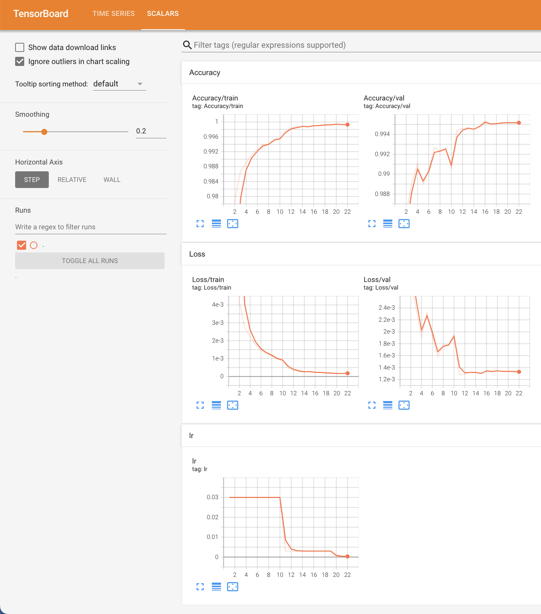

# AlexNet

[toc]

## 1 Paper

> * 李沐：https://zh-v2.d2l.ai/chapter_convolutional-modern/alexnet.html

| |    LeNet     | AlexNet |
|:---:| :---------: | :--: |
|结构|较浅的网络|多了“Conv-Conv-Relu”,更深了一点|
|硬件|算力不足|GPU|
|成就|MNIST|ImageNet冠军|
|激活函数|sigmoid|ReLU|
|参数大小|181KB|228MB|
|skill|无|更多的图像增强, 加入 Dropout|

## 2 Project


### 2.1. Overview

* 项目简介
    * 这是一个基于 Pytorch2 的 AlexNet 复现，并在 MNIST 数据集上进行训练与测试。
    * 该项目借用我自己写的深度学习基础框架 clib，由于 AlexNet 网络比较大，所以只保留最新的十个 checkpoint，较老的 checkpoint 会自动删掉。
* 实现细节
    * 大体和和 LeNet 的比较像：SGD、Holdout 训练、tensorboard记录过程、ReduceLROnPlateau 调整学习率。
    * 详细介绍移至：[Lenet Readme](../lenet/README.md)

### 2.2. Roadmap

1. `check_path.sh`: 
   1. 建议公开的内容都放在 public 文件夹。
   2. 建议数据集都放在 data 文件夹。
   3. 建议自己写的库都放在 library 文件夹。
   4. 建议自己的项目工程都放在 project 文件夹。
   5. vision 文件夹用来存放本工程（cvplayground）的数据。
   6. 下边列表中先考虑服务器路径，然后是本地硬盘路径，最后是本地路径。
   ```bash
   #!/bin/bash

    # Define dataset path list
    paths=(
        '/root/autodl-fs/data/vision'
        '/home/vision/users/sht/data/vision'
        '/Volumes/Charles/data/vision'
        '/Users/kimshan/Public/data/vision'
    )

    # Find the first exist path
    for path in "${paths[@]}"; do
        if [ -d "$path" ]; then
            echo "$path"
            exit 0
        fi
    done
    exit 1
   ```
2. 训练: `./train.sh`。会生成 tensorboard 记录，如下图。
   
3. 测试: `./test.sh`，注意请在 shell 脚本配置好要测试的 checkpoint 文件。
   ```bash
    SSH:  vision@pla ~/u/s/p/C/a/samples $ ./test.sh                           (sht) 0⚹  1↺  0🗴 0≡   🜉 master 
    [ AlexNet ] ========== Parameters ==========
    [ AlexNet ]            name : AlexNet
    [ AlexNet ]         comment : AlexNet on MNIST
    [ AlexNet ]          device : cuda
    [ AlexNet ]      model_path : /home/vision/users/sht/data/vision/model/alexnet/mnist/9957/checkpoints/19.pt
    [ AlexNet ]    dataset_path : /home/vision/users/sht/data/vision/torchvision
    [ AlexNet ]      image_size : 224
    [ AlexNet ]     num_classes : 10
    [ AlexNet ]      batch_size : 32
    [ AlexNet ] ===============================
    Accuracy of the model on the 10000 test images: 99.57%
    ```