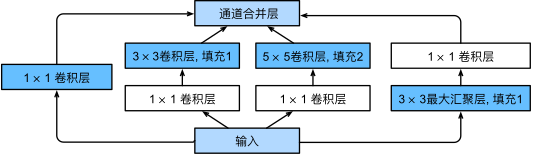

# GoogLeNet

[toc]

## 1 Paper

> * 李沐：https://zh.d2l.ai/chapter_convolutional-modern/googlenet.html

## 2 Project




### 2.1. Overview

1. 主流的 3x3 或者 5x5 的卷积核很有效，之前提出的 NIN 网络里边的 1x1 卷积核也很有用。这个文章把各种大小的卷积核合起来，取百家之长，组成了 Inception 块。
2. 为什么用了 3x3、 5x5没有更大的？原文说“为了避免补丁对齐问题，Inception架构的当前版本仅限于滤波器大小1×1、3×3和5×5，这一决定更多地是基于便利而非必要性。”
3. 本项目目的是学习  GoogLeNet 网络并且提供一个可以调用的模型。所以，仅提供 `test.sh` 并使用 torchvision 的模型和参数进行推理。

### 2.2. Roadmap

1. `dataset.sh`: 和`vgg`一样，采用了 ImageNet-1k 的验证集，仅作为测试。
    ```bash
        kimshan@cMac ~/P/p/c/g/samples (master)> ./dataset.sh                                                                     (pytorch2) 
        Number of classes: 1000
        Class names (first 10): [('tench', 'Tinca tinca'), ('goldfish', 'Carassius auratus'), ('great white shark', 'white shark', 'man-eater', 'man-eating shark', 'Carcharodon carcharias'), ('tiger shark', 'Galeocerdo cuvieri'), ('hammerhead', 'hammerhead shark'), ('electric ray', 'crampfish', 'numbfish', 'torpedo'), ('stingray',), ('cock',), ('hen',), ('ostrich', 'Struthio camelus')]
        Sample 0: Label 0, Image shape (500, 375)
    ```
2. `test.sh`: 对模型进行测试，采用 ImageNet 的验证集。
    ```bash
        kimshan@cMac ~/P/p/c/g/samples (master) [2]> ./test.sh                                                                    (pytorch2) 
        [ GoogLeNet ] ========== Parameters ==========
        [ GoogLeNet ]            name : GoogLeNet
        [ GoogLeNet ]         comment : Pretrained GoogLeNet on ImageNet
        [ GoogLeNet ]          device : cpu
        [ GoogLeNet ]      model_path : /Users/kimshan/Public/data/vision/model/googlenet/imagenet-1k
        [ GoogLeNet ]    dataset_path : /Users/kimshan/Public/data/vision/torchvision
        [ GoogLeNet ]      model_name : googlenet
        [ GoogLeNet ]      batch_size : 16
        [ GoogLeNet ] ===============================
        /Users/kimshan/.local/micromamba/envs/pytorch2/lib/python3.12/site-packages/torchvision/models/_utils.py:223: UserWarning: Arguments other than a weight enum or `None` for 'weights' are deprecated since 0.13 and may be removed in the future. The current behavior is equivalent to passing `weights=GoogLeNet_Weights.IMAGENET1K_V1`. You can also use `weights=GoogLeNet_Weights.DEFAULT` to get the most up-to-date weights.
        warnings.warn(msg)
        Downloading: "https://download.pytorch.org/models/googlenet-1378be20.pth" to /Users/kimshan/Public/data/vision/model/googlenet/imagenet-1k/googlenet-1378be20.pth
        100%|███████████████████████████████████████████████████████████████████████████████████████████| 49.7M/49.7M [00:04<00:00, 10.8MB/s]
        100%|███████████████████████████████████████████████████████████████████████████████| 3125/3125 [1:24:48<00:00,  1.63s/it, acc=0.698]
        Accuracy of the model on the 50000 test images: 69.77%
    ```