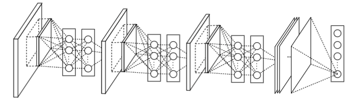
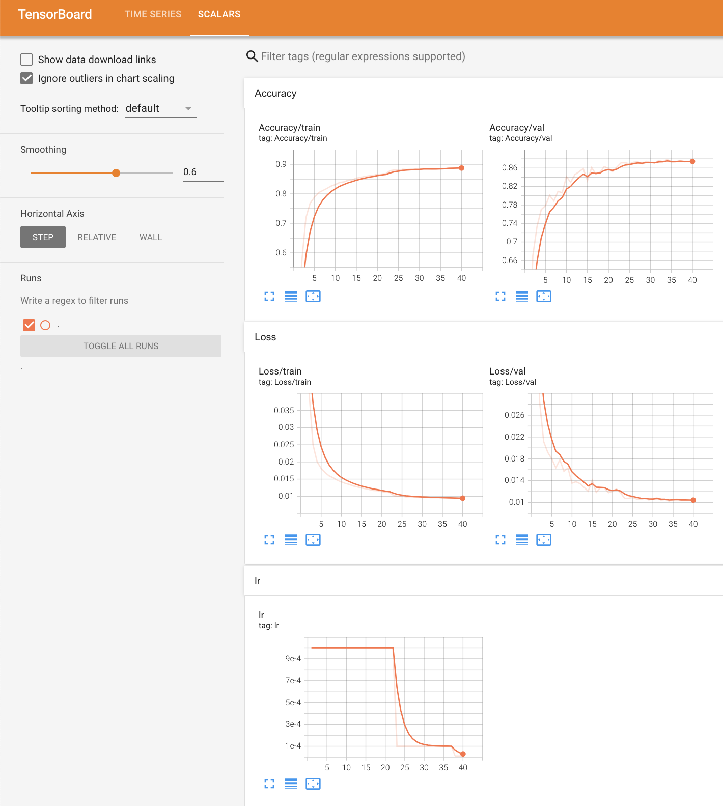

# Network in network

[toc]

## 1 Paper

Network In Network 是发表于 2014 年 ICLR 的一篇 paper。这篇文章采用较少参数就取得了 Alexnet 的效果，Alexnet 参数大小为 230M，而 Network In Network 仅为 29M，这篇 paper 主要两大亮点：mlpconv (multilayer perceptron，MLP，多层感知机) 作为 "micro network" 和 Global Average Pooling（全局平均池化）。

> * 论文地址：https://arxiv.org/abs/1312.4400
> * 李沐：https://zh.d2l.ai/chapter_convolutional-modern/nin.html
> * https://developer.aliyun.com/article/1057504
> * https://juejin.cn/post/7064475270417219598
> * https://cloud.tencent.com/developer/article/1666965

### 局部响应归一化

`LocalResponseNorm`（局部响应归一化，LRN）是一种在深度学习中用于对卷积层输出进行归一化的技术。LRN 的目的是通过在相邻的特征图之间引入竞争机制来增强模型的泛化能力，通常用于计算机视觉任务中。
LRN 的灵感来自于生物学中的侧抑制现象，即相邻的神经元相互抑制。在神经网络中，LRN 对每个特征图的相邻激活进行归一化，使那些较大的激活相对增强，而较小的激活相对减弱。
具体来说，LRN 的计算公式如下：
$$ b_{x,y}^{i} = a_{x,y}^{i} \left( k + \alpha \sum_{j=max(0, i-n/2)}^{min(N-1, i+n/2)} (a_{x,y}^{j})^2 \right)^{-\beta} $$

其中：

* $ a_{x,y}^{i} $ 是在位置 $ (x, y) $ 的第 $ i $ 个特征图的激活值。
* $ b_{x,y}^{i} $ 是归一化后的激活值。
* $ N $ 是特征图的数目。
* $ n $ 是局部邻域的大小。
* $ k $、$ \alpha $ 和 $ \beta $ 是超参数，通常通过交叉验证来选择。
LRN 的参数包括：
* `size`：定义局部邻域的大小，通常设置为 5。
* `alpha`：缩放因子，通常设置为 0.0001。
* `beta`：指数，通常设置为 0.75。
* `k`：偏差项，通常设置为 2。

在 PyTorch 中，`LocalResponseNorm` 可以通过以下方式使用：

```python
import torch.nn as nn
# 创建一个LocalResponseNorm层
lrn = nn.LocalResponseNorm(size=5, alpha=0.0001, beta=0.75, k=2)
```

然后将这个层插入到神经网络中，通常紧跟在卷积层之后。
尽管 LRN 在某些网络架构（如 AlexNet）中曾经流行，但近年来，其他类型的归一化方法（如批量归一化 Batch Normalization）更为常用，因为它们在训练过程中提供了更稳定的梯度，并且通常能带来更好的性能。因此，LRN 在现代网络架构中并不常见。

## 2 Project



### 2.1. Overview

1. 直观理解可能不容易，可以这样想。
   1. 一个 3x3 的卷积，输入的一个像素是 3x3 大小的感受野。一个 1x1 的卷积，输入的就是一个像素的感受野，所以它不改变图片分辨率。
   2. 一个 1x1 的卷积，如果输出维度是 1，那么就是 m 层特征图的每一个通道进行加权求和，得到新的一个特征。输出 n 个特征图的话，参数量就是 $m\cdot n\cdot 1\cdot 1$

2. 本案例训练 MNIT 时发现完整的网络 train 不动，删掉了一些层可以训练，可能是是数据集太简单了。换成了 FashionMNIST 就可以了。

   ```bash
   — SSH:  vision@pla ~/u/s/p/c/n/samples $ ./train.sh                                                    (sht) 0⚹  18↺  0🗴 0≡   🜉 master 
   Downloading http://fashion-mnist.s3-website.eu-central-1.amazonaws.com/train-images-idx3-ubyte.gz
   Downloading http://fashion-mnist.s3-website.eu-central-1.amazonaws.com/train-images-idx3-ubyte.gz to /home/vision/users/sht/data/vision/torchvision/FashionMNIST/raw/train-images-idx3-ubyte.gz
   100%|█████████████████████████████████████████████████████████████████████████████████████████████| 26.4M/26.4M [00:04<00:00, 5.34MB/s]
   Extracting /home/vision/users/sht/data/vision/torchvision/FashionMNIST/raw/train-images-idx3-ubyte.gz to /home/vision/users/sht/data/vision/torchvision/FashionMNIST/raw

   Downloading http://fashion-mnist.s3-website.eu-central-1.amazonaws.com/train-labels-idx1-ubyte.gz
   Downloading http://fashion-mnist.s3-website.eu-central-1.amazonaws.com/train-labels-idx1-ubyte.gz to /home/vision/users/sht/data/vision/torchvision/FashionMNIST/raw/train-labels-idx1-ubyte.gz
   100%|██████████████████████████████████████████████████████████████████████████████████████████████| 29.5k/29.5k [00:00<00:00, 199kB/s]
   Extracting /home/vision/users/sht/data/vision/torchvision/FashionMNIST/raw/train-labels-idx1-ubyte.gz to /home/vision/users/sht/data/vision/torchvision/FashionMNIST/raw

   Downloading http://fashion-mnist.s3-website.eu-central-1.amazonaws.com/t10k-images-idx3-ubyte.gz
   Downloading http://fashion-mnist.s3-website.eu-central-1.amazonaws.com/t10k-images-idx3-ubyte.gz to /home/vision/users/sht/data/vision/torchvision/FashionMNIST/raw/t10k-images-idx3-ubyte.gz
   100%|█████████████████████████████████████████████████████████████████████████████████████████████| 4.42M/4.42M [00:00<00:00, 4.69MB/s]
   Extracting /home/vision/users/sht/data/vision/torchvision/FashionMNIST/raw/t10k-images-idx3-ubyte.gz to /home/vision/users/sht/data/vision/torchvision/FashionMNIST/raw

   Downloading http://fashion-mnist.s3-website.eu-central-1.amazonaws.com/t10k-labels-idx1-ubyte.gz
   Downloading http://fashion-mnist.s3-website.eu-central-1.amazonaws.com/t10k-labels-idx1-ubyte.gz to /home/vision/users/sht/data/vision/torchvision/FashionMNIST/raw/t10k-labels-idx1-ubyte.gz
   100%|█████████████████████████████████████████████████████████████████████████████████████████████| 5.15k/5.15k [00:00<00:00, 14.3MB/s]
   Extracting /home/vision/users/sht/data/vision/torchvision/FashionMNIST/raw/t10k-labels-idx1-ubyte.gz to /home/vision/users/sht/data/vision/torchvision/FashionMNIST/raw

   [ Nin ] ========== Parameters ==========
   [ Nin ]            name : Nin
   [ Nin ]         comment : NIN on FashionMNIST with ReduceLROnPlateau on SGD
   [ Nin ]          device : cuda
   [ Nin ] model_base_path : /home/vision/users/sht/data/vision/model/nin/mnist/2024_12_20_08_29
   [ Nin ]    dataset_path : /home/vision/users/sht/data/vision/torchvision
   [ Nin ]      image_size : 224
   [ Nin ]     num_classes : 10
   [ Nin ]            seed : 42
   [ Nin ]      batch_size : 32
   [ Nin ]       optimizer : SGD
   [ Nin ]              lr : 0.001
   [ Nin ]    lr_scheduler : ReduceLROnPlateau
   [ Nin ]       max_epoch : 100
   [ Nin ]      max_reduce : 3
   [ Nin ]          factor : 0.1
   [ Nin ]      train_mode : Holdout
   [ Nin ]             val : 0.2
   [ Nin ] ===============================
   Epoch [1/100]: 100%|████████████████████████████████████████████████████████████████████| 1500/1500 [00:31<00:00, 47.24it/s, loss=2.08]
   Epoch [1/100] Train Loss: 0.0650, Train Accuracy: 0.2718
   Epoch [1/100] Val Loss: 0.0502, Val Accuracy: 0.4236
   Epoch [2/100]: 100%|█████████████████████████████████████████████████████████████████████| 1500/1500 [00:30<00:00, 48.59it/s, loss=1.3]
   Epoch [2/100] Train Loss: 0.0405, Train Accuracy: 0.5671
   Epoch [2/100] Val Loss: 0.0284, Val Accuracy: 0.6703
   Epoch [3/100]: 100%|
   ...
   ██████████████████████████████████████████████████████████████████| 1500/1500 [00:30<00:00, 48.70it/s, loss=0.303]
   Epoch [38/100] Train Loss: 0.0095, Train Accuracy: 0.8879
   Epoch [38/100] Val Loss: 0.0105, Val Accuracy: 0.8736
   Epoch [39/100]: 100%|██████████████████████████████████████████████████████████████████| 1500/1500 [00:30<00:00, 48.84it/s, loss=0.302]
   Epoch [39/100] Train Loss: 0.0094, Train Accuracy: 0.8877
   Epoch [39/100] Val Loss: 0.0105, Val Accuracy: 0.8743
   Epoch [40/100]: 100%|██████████████████████████████████████████████████████████████████| 1500/1500 [00:30<00:00, 48.76it/s, loss=0.301]
   Epoch [40/100] Train Loss: 0.0094, Train Accuracy: 0.8877
   Epoch [40/100] Val Loss: 0.0104, Val Accuracy: 0.8745
   Training has converged. Stopping...
   Accuracy of the model on the 10000 test images: 87.02%
   ```

   

3. `test`
   
   ```bash
   — SSH:  vision@pla ~/u/s/p/c/n/samples $ ./test.sh                                                     (sht) 0⚹  21↺  0🗴 0≡   🜉 master 
   [ Nin ] ========== Parameters ==========
   [ Nin ]            name : Nin
   [ Nin ]         comment : Nin on FashionMNIST
   [ Nin ]          device : cuda
   [ Nin ]      model_path : /home/vision/users/sht/data/vision/model/nin/mnist/2024_12_20_08_29/checkpoints/40.pt
   [ Nin ]    dataset_path : /home/vision/users/sht/data/vision/torchvision
   [ Nin ]      image_size : 224
   [ Nin ]     num_classes : 10
   [ Nin ]      batch_size : 32
   [ Nin ] ===============================
   Accuracy of the model on the 10000 test images: 87.02%
   ```
