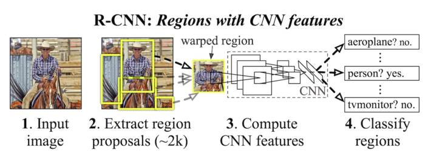
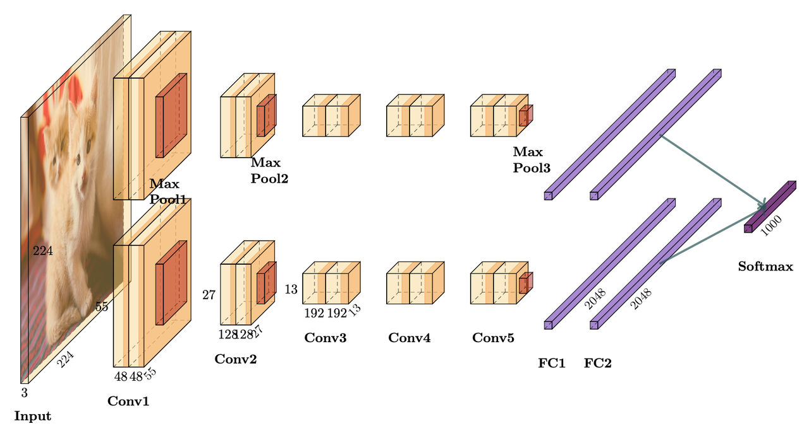
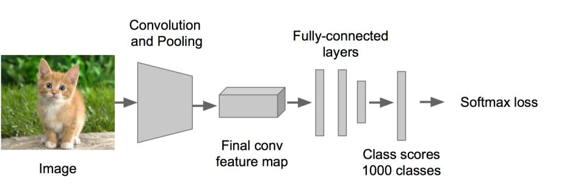
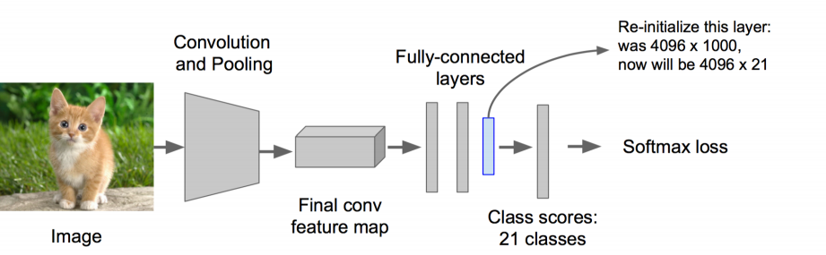
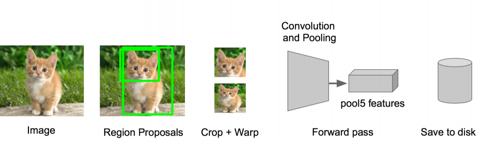
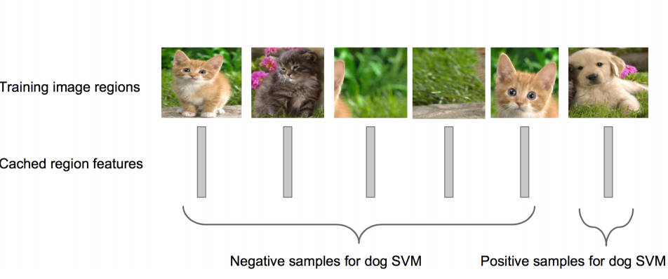
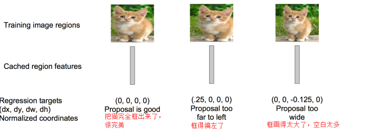
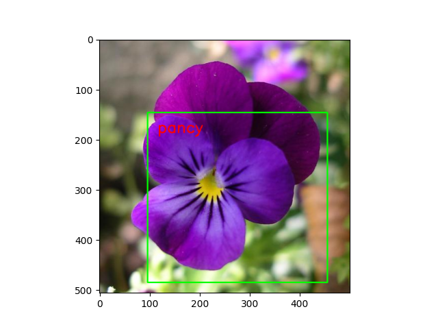

# RCNN

## Overview



- Modified from: https://github.com/cassiePython/RCNN
- Dataset: https://www.robots.ox.ac.uk/~vgg/data/flowers/17/
- Note: https://blog.csdn.net/v_JULY_v/article/details/80170182

## Roadmap

1. 训练（或者下载）一个分类模型（比如 AlexNet）本项目用的 Flowers102 的简单版本——Flowers17。这一步训练出来了输出为 17 的分类器。

   - 原文中，采用 ImageNet 训练，输出 1000 个种类
   - 本项目，采用 flowers17 训练，输出 17 个种类
   
   原文中网络结构（为了分两块 GPU 训练）

   

   这里可以简化成这样
   
   

   ```bash
   (Pytorch2) kimshan@MacBook-Pro-2 RCNN % chmod 777 ./train_classifier.sh  
   (Pytorch2) kimshan@MacBook-Pro-2 RCNN % ./train_classifier.sh
   ```

   可以运行测试，指定某个 checkpoint 的测试得分

   ```bash
   (clib_temp) root@autodl-container-8f014e8cf1-6840ba4e:~/autodl-tmp/CVPlayground/models/RCNN# ./test_classifier.sh 
   
   [ RCNN - AlexNet ] ========== Parameters ==========
   [ RCNN - AlexNet ]            name : RCNN - AlexNet
   [ RCNN - AlexNet ]         comment : (RCNN on 17flowers) step1: Train AlexNet Classifier(with pre-trained model)
   [ RCNN - AlexNet ]          device : cuda
   [ RCNN - AlexNet ]      model_path : /root/autodl-fs/DataSets/Model/RCNN/Flowers17/AlexNet_Classifier/checkpoints/43.pt
   [ RCNN - AlexNet ]    dataset_path : /root/autodl-fs/DataSets/torchvision
   [ RCNN - AlexNet ]     num_classes : 17
   [ RCNN - AlexNet ]      batch_size : 32
   [ RCNN - AlexNet ]      image_size : 224
   [ RCNN - AlexNet ] ===============================
   Accuracy of the model on the 1020 test images: 95.98%
   ```
2. 对该模型做 fine-tuning

   - 特征提取用了选择性搜索，从大的图里边通过传统方法选出很多候选框，然后再跟据 IOU 等内容进行筛选。这会作为 finetune 的输入。

   

   - 原论文中，将分类数从 1000 改为 21，比如 20 个物体类别 + 1 个背景
   - 本项目，从 flowers17 再写了一个 flowers2数据集，模型输出 2+1=3 类

   

   训练：`./train_finetune.sh`

   测试
   ```bash
   (clib_temp) root@autodl-container-8f014e8cf1-6840ba4e:~/autodl-tmp/CVPlayground/models/RCNN# ./test_finetune.sh 
   [ RCNN - AlexNet ] ========== Parameters ==========
   [ RCNN - AlexNet ]            name : RCNN - AlexNet
   [ RCNN - AlexNet ]         comment : (RCNN on 2flowers) step2: Finetune AlexNet Classifier(with pre-trained model)
   [ RCNN - AlexNet ]          device : cuda
   [ RCNN - AlexNet ]      model_path : /root/autodl-fs/DataSets/Model/RCNN/Flowers17/AlexNet_Finetune/checkpoints/51.pt
   [ RCNN - AlexNet ]    dataset_path : /root/autodl-fs/DataSets/torchvision
   [ RCNN - AlexNet ]     num_classes : 3
   [ RCNN - AlexNet ]      batch_size : 32
   [ RCNN - AlexNet ]      image_size : 224
   [ RCNN - AlexNet ]        val_size : 0.1
   [ RCNN - AlexNet ]       test_size : 0.1
   [ RCNN - AlexNet ]            seed : 42
   [ RCNN - AlexNet ] ===============================
   Accuracy of the model on the 142 test images: 92.25%
   ```

3. 特征提取

   - 提取图像的所有候选框（选择性搜索 Selective Search）
   - 对于每一个区域：修正区域大小以适合 CNN 的输入，做一次前向运算，将第五个池化层的输出（就是对候选框提取到的特征）存到硬盘

   

4. 训练一个 SVM 分类器（二分类）来判断这个候选框里物体的类别每个类别对应一个 SVM，判断是不是属于这个类别，是就是 positive，反之 nagative。比如下图，就是狗分类的 SVM

   

   首先要为 SVM 保存 AlexNet 的输出的特征。比如下边 batch是 8，一共 179 次，就是输出大约(179*8, 4096)维度大小的 features
   ```bash
   (clib_temp) root@autodl-container-8f014e8cf1-6840ba4e:~/autodl-tmp/CVPlayground/models/RCNN# ./save_feature.sh 
   [ RCNN - AlexNet ] ========== Parameters ==========
   [ RCNN - AlexNet ]            name : RCNN - AlexNet
   [ RCNN - AlexNet ]         comment : (RCNN on 2flowers) step3: Save Feature from Finetune AlexNet Classifier
   [ RCNN - AlexNet ]          device : cuda
   [ RCNN - AlexNet ]      model_path : /root/autodl-fs/DataSets/Model/RCNN/Flowers17/AlexNet_Finetune/checkpoints/51.pt
   [ RCNN - AlexNet ]    dataset_path : /root/autodl-fs/DataSets/torchvision
   [ RCNN - AlexNet ]     num_classes : 3
   [ RCNN - AlexNet ]      batch_size : 8
   [ RCNN - AlexNet ]      image_size : 224
   [ RCNN - AlexNet ]            seed : 42
   [ RCNN - AlexNet ] ===============================
   100%|███████████████████████████████████████████████████████████████████████████████████████████████████████████████████████████████████████| 179/179 [00:01<00:00, 132.81it/s]
   ```

   然后训练 SVM: 

   ```bash
   (clib_temp)root@autodl-container-8f014e8cf1-6840ba4e:~/autodl-tmp/CVPlayground/models/RCNN# ./train_svm.sh 
   [ RCNN - SVM ] ========== Parameters ==========
   [ RCNN - SVM ]            name : RCNN - SVM
   [ RCNN - SVM ]         comment : (RCNN on 2flowers) step4: Train SVM
   [ RCNN - SVM ]          device : cuda
   [ RCNN - SVM ] model_base_path : /root/autodl-fs/DataSets/Model/RCNN/Flowers17/2024_11_04_15_25
   [ RCNN - SVM ]    dataset_path : /root/autodl-fs/DataSets/torchvision
   [ RCNN - SVM ]      image_size : 224
   [ RCNN - SVM ] ===============================
   Validation accuracy for flower 1: 0.9846743295019157
   Validation accuracy for flower 2: 0.9940119760479041
   ```

5. 使用回归器精细修正候选框位置：对于每一个类，训练一个线性回归模型去判定这个框是否框得完美。

   - 训练回归器：`./train_reg.sh`

   

6. 最后运行推理:`python evaluate.py`

   - 
