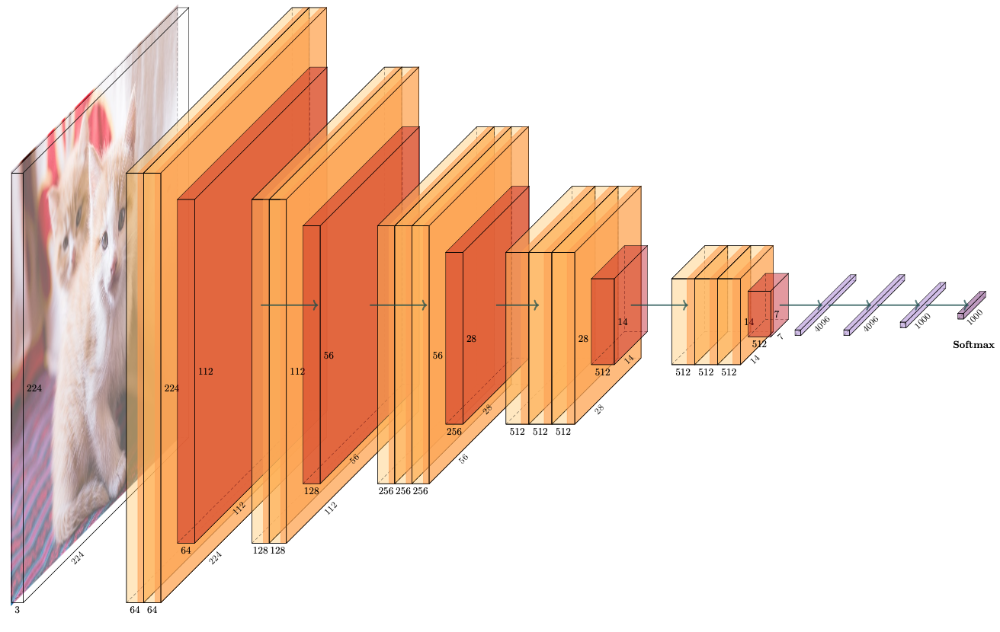
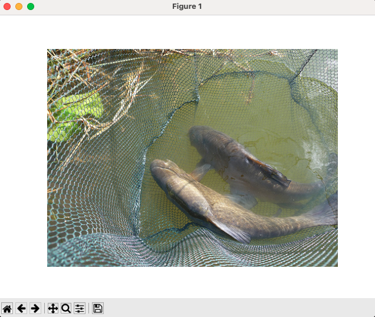

# VGG

[toc]

## 1 Paper

> * 李沐：https://zh.d2l.ai/chapter_convolutional-modern/vgg.html


## 2 Project



### 2.1. Overview

1. VGG 就是“内卷”版的 AlexNet。提出 “卷积-卷积-池化”这种结构，通过变化卷积的次数以及整个块的次数，改变网络结构。
2. 本项目目的是学习 VGG 网络并且提供一个可以调用的模型。所以，仅提供 `test.sh` 并使用 torchvision 的模型和参数进行推理。

### 2.2. Roadmap

1. `dataset.sh`: 
   1. 本来打算用 TinyImageNet 来运行预训练的模型。但是鉴于 TinyImageNet 仅仅是目录结构和 ImageNet1k 一致，数据标签并不一致，所以另寻他法。
   2. 因为 torchvision.datasets.imagenet.ImageNet 类仅支持完整的数据集，但 ImageNet 训练集太大，所以使用我写的 ImageNetVal 类。
   3. 该类可以自动下载 Imagenet 测试集和 dev-kit 包。
    ```
    kimshan@cMac ~/P/p/c/v/sample (master)> ./dataset.sh                                                                                                    (pytorch2) 
    /Users/kimshan/.local/micromamba/envs/pytorch2/lib/python3.12/site-packages/timm/models/layers/__init__.py:48: FutureWarning: Importing from timm.models.layers is deprecated, please import via timm.layers
    warnings.warn(f"Importing from {__name__} is deprecated, please import via timm.layers", FutureWarning)
    Downloading https://image-net.org/data/ILSVRC/2012/ILSVRC2012_img_val.tar to /Users/kimshan/Public/data/vision/torchvision/ILSVRC2012_img_val.tar
    100%|█████████████████████████████████████████████████████████████████████████████████████████████████████████████████████████████████████████| 6.74G/6.74G [11:54<00:00, 9.44MB/s]
    Extracting /Users/kimshan/Public/data/vision/torchvision/ILSVRC2012_img_val.tar to /Users/kimshan/Public/data/vision/torchvision
    Downloading https://image-net.org/data/ILSVRC/2012/ILSVRC2012_devkit_t12.tar.gz to /Users/kimshan/Public/data/vision/torchvision/ILSVRC2012_devkit_t12.tar.gz
    100%|█████████████████████████████████████████████████████████████████████████████████████████████████████████████████████████████████████████| 2.57M/2.57M [00:01<00:00, 1.66MB/s]
    Extracting /Users/kimshan/Public/data/vision/torchvision/ILSVRC2012_devkit_t12.tar.gz to /Users/kimshan/Public/data/vision/torchvision
    Number of classes: 1000
    Class names (first 10): [('tench', 'Tinca tinca'), ('goldfish', 'Carassius auratus'), ('great white shark', 'white shark', 'man-eater', 'man-eating shark', 'Carcharodon carcharias'), ('tiger shark', 'Galeocerdo cuvieri'), ('hammerhead', 'hammerhead shark'), ('electric ray', 'crampfish', 'numbfish', 'torpedo'), ('stingray',), ('cock',), ('hen',), ('ostrich', 'Struthio camelus')]
    Sample 0: Label 0, Image shape (500, 375)
    ```
    

2. `test.sh`: 
   1. 对模型进行测试，采用 ImageNet 的验证集。因为模型比较大，所以并没有推理完结果，但推理过程中可以实时显示目前的准确率。
   2. 请在 test.sh 中设置要推理的模型，VGG11, VGG13, VGG16, VGG19，对应的 bn 版本。所有的内容都会自动下载到指定位置。
   ```
      kimshan@cMac ~/P/p/c/v/sample (master)> ./test.sh                             (pytorch2) 
   [ VGG ] ========== Parameters ==========
   [ VGG ]            name : VGG
   [ VGG ]         comment : Pretrained VGG on ImageNet
   [ VGG ]          device : cpu
   [ VGG ]      model_path : /Users/kimshan/Public/data/vision/model/vgg/imagenet-1k
   [ VGG ]    dataset_path : /Users/kimshan/Public/data/vision/torchvision
   [ VGG ]      model_name : vgg11
   [ VGG ]      batch_size : 16
   [ VGG ] ===============================
   Downloading: "https://download.pytorch.org/models/vgg11-8a719046.pth" to /Users/kimshan/Public/data/vision/model/vgg/imagenet-1k/vgg11-8a719046.pth
   100%|█████████████████████████████████████████████████| 507M/507M [00:58<00:00, 9.12MB/s]
   1%|▏                                    | 17/3125 [00:25<1:18:37,  1.52s/it, acc=0.812]
   ```